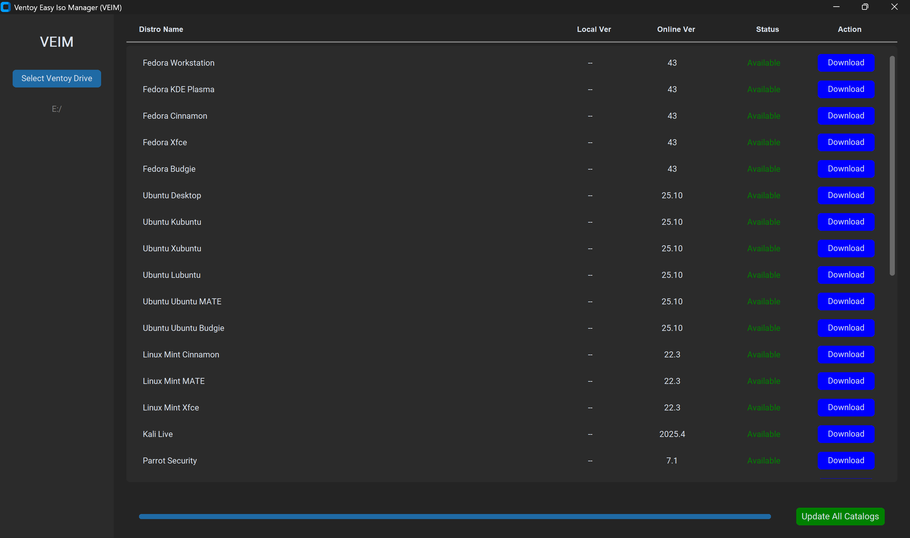

# Ventoy Easy Iso Manager (VEIM)



**VEIM** is a powerful, Python-based utility designed to streamline the management of Linux ISO files for your [Ventoy](https://www.ventoy.net/) bootable USB drive. It automates the tedious process of checking for updates, downloading the latest ISOs, and organizing them on your drive.


## 🚀 Features

*   **Automated Updates**: robust scraping logic to find the latest versions of 20+ popular Linux distributions. bypasses common scraping blocks (e.g., Cloudflare, 403s on Kali/Pop!OS) using smart mirrors and heuristics.
*   **Sequential "Fast Scan"**: Checks for updates using a high-performance staggered threading model (200ms delay), providing immediate visual feedback without freezing the UI.
*   **Smart Downloading**: Automatically downloads ISOs to your Ventoy drive's `Managed_ISOs` folder, handling large files with resume support (where supported) and progress tracking.
*   **Local Inventory**: Detects currently installed versions on your drive and compares them with online sources.
*   **Modern UI**: Built with `customtkinter` for a clean, dark-mode compatible interface.

## 📦 Supported Distributions

VEIM currently supports the following families of distributions:

### 🔹 The Big Three & Flavors
*   **Fedora**: Workstation, KDE Plasma, Cinnamon, Xfce, Budgie
*   **Ubuntu**: Desktop, Kubuntu, Xubuntu, Lubuntu, MATE, Budgie
*   **Linux Mint**: Cinnamon, MATE, Xfce

### 🛡️ Security & Pentesting
*   **Kali Linux**: Live (Standard)
*   **Parrot OS**: Security, Home

### 🎨 Beautiful & User-Friendly
*   **Zorin OS**: Core, Lite
*   **KDE Neon**: User Edition
*   **Pop!_OS**: Standard, NVIDIA

### 🔄 Rolling Releases
*   **Arch Linux**
*   **Manjaro**: Plasma, GNOME, Xfce
*   **EndeavourOS**

### 🪶 Lightweight
*   **Puppy Linux**: BookwormPup64, FossaPup64
*   **TinyCore**: CorePlus, TinyCore

## 🛠️ Installation

1.  **Clone the Repository**:
    ```bash
    git clone https://github.com/Cir0cuit/VEIM
    cd VEIM
    ```

2.  **Install Dependencies**:
    VEIM requires Python 3.8+ and the following libraries:
    ```bash
    pip install -r requirements.txt
    ```
    *(Dependencies include: `customtkinter`, `requests`, `beautifulsoup4`, `lxml`)*

3.  **Run the Application**:
    ```bash
    python main.py
    ```

## 📖 Usage

1.  **Select Drive**: Click **"Select Ventoy Drive"** and choose the **root directory** of your Ventoy USB stick (e.g., `E:\`).
2.  **Initialization**: 
    - VEIM will automatically create a dedicated folder named `Managed_ISOs` in the root directory if it does not exist.
    - **Your other files are safe!** VEIM *only* touches files inside this `Managed_ISOs` folder. It will ignore your other ISOs, documents, and folders in the root directory, allowing you to freely use the drive for other purposes and your own ISOs.
3.  **Scan & Update**: 
    - Click **"Update All Catalogs"** to fetch the latest online versions for all supported distributions.
    - The list will update to show which versions are "Available" to install, update or download.
4.  **Download**: Click **"Download"** next to any available update to fetch the new ISO directly into the `Managed_ISOs` folder. If the **Online Version** is a successor of **Local Version**, VEIM will automatically overwrite outdated ISO when you download an updated version of a Linux distribution.

## 🤝 Contributing

This project is open for everyone! Feel free to **fork this repository** and continue its development. Whether you want to add new distribution recipes, improve the UI, or optimize the backend, this is your playground.

## 🤖 AI-Powered Development

This project was primarily architected and developed with the assistance of **Gemini 3 Pro**, an advanced AI model by Google. It demonstrates the potential of AI-assisted coding in creating functional, real-world utility software.

## ⚠️ Disclaimer

This tool is not affiliated with Ventoy or any of the Linux distributions it manages. Use responsibly.

## 📄 License

This project is licensed under the MIT License.
