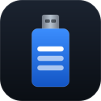
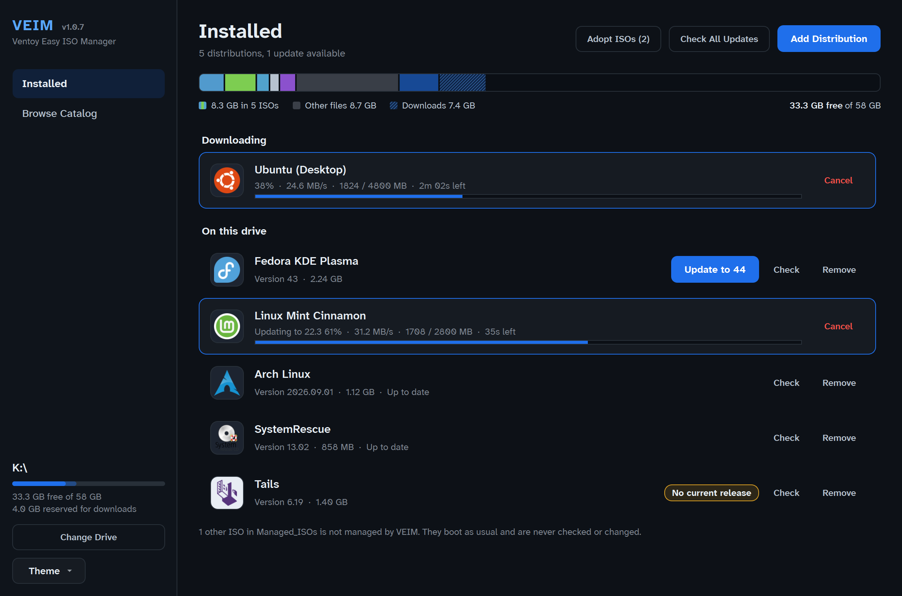
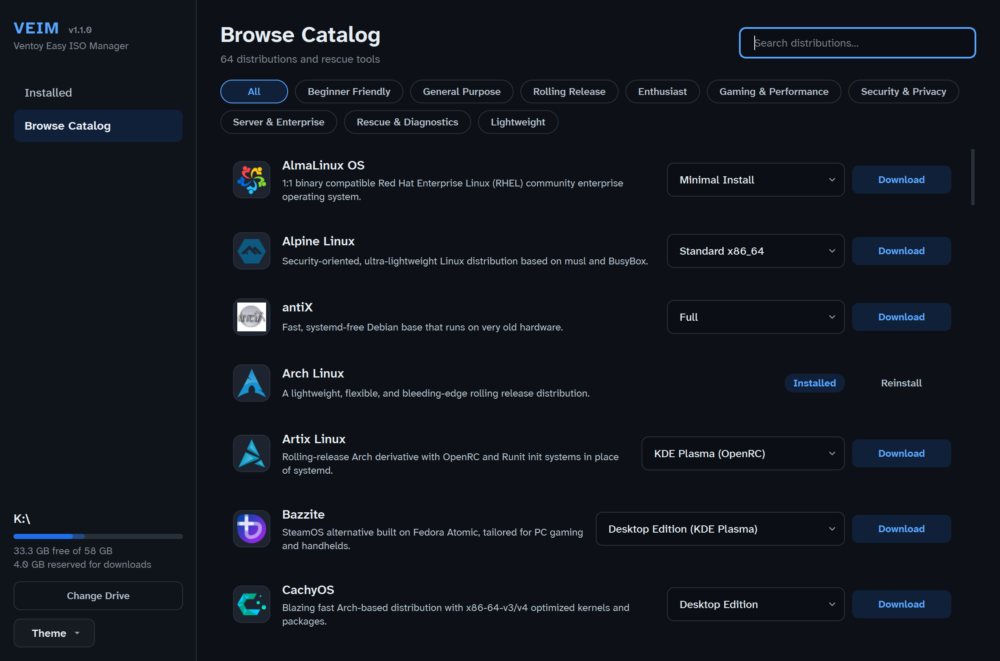
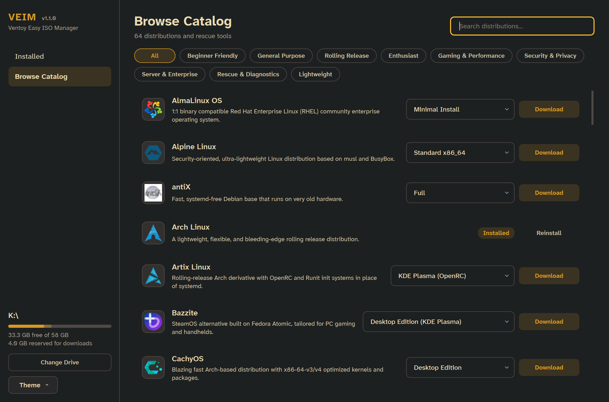
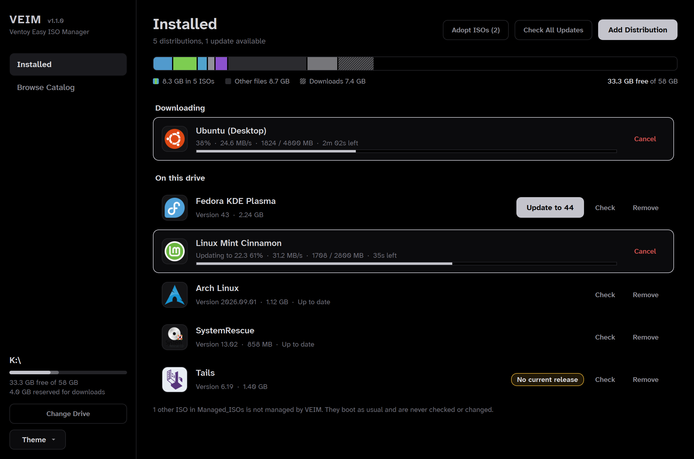
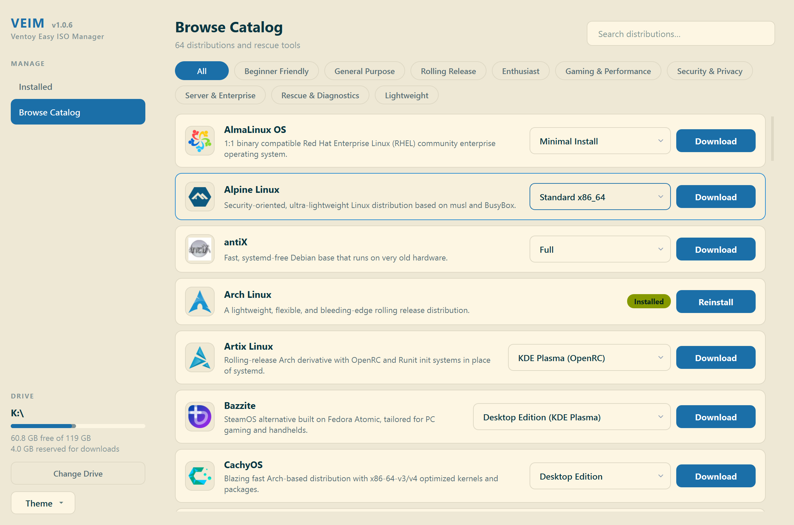

<div align="center">



# VEIM

**Ventoy Easy ISO Manager**

Keep the operating systems and tools on your [Ventoy](https://www.ventoy.net/)
USB drive up to date, without hunting down a download page for every one.

[](https://github.com/Cir0cuit/VEIM/actions/workflows/ci.yml)


[**Download**](https://github.com/Cir0cuit/VEIM/releases/latest) · 50 distributions · 139 editions



<em>Two releases have moved on, two are current, one project's mirror could not be
reached, and Ubuntu is downloading.</em>

</div>

---

## What it is

Ventoy makes a single USB drive boot anything you copy onto it. Put a dozen ISO
files on the stick and choose one from a menu at boot: try a live desktop, run
an installer, boot a rescue system, test your RAM. No reflashing between them.

The hard part is keeping that collection current. Six months later the files on
the drive look exactly as they did the day you copied them, and the only way to
find out which ones have been superseded is to open a dozen download pages and
compare version numbers by hand. Most sticks quietly go stale instead.

VEIM does that checking for you. Point it at the drive and it lists what is on
there, marks what has a newer release available, downloads the replacement, and
gives the boot menu readable names instead of
`linuxmint-22.3-cinnamon-64bit.iso`.

> **VEIM is not Ventoy, and does not replace it.** Ventoy is a separate tool
> that you install onto the drive once, [from its own site](https://www.ventoy.net/).
> VEIM manages the ISO files on a drive that already has it. It never formats,
> partitions or reflashes anything.

## Download

Grab the file for your system from the
[latest release](https://github.com/Cir0cuit/VEIM/releases/latest) and open it.
Nothing else to install.

| | |
|---|---|
| **Windows** | `VEIM-x.y.z-windows-setup.exe` — double-click, next, done. Installs for your user only, so there is no administrator prompt. A portable `.zip` is there too if you would rather not install anything. |
| **macOS** | `VEIM-x.y.z-macos-arm64.dmg` (Apple Silicon) or `-x86_64.dmg` (Intel). Open it and drag VEIM to Applications. |
| **Linux** | `VEIM-x.y.z-x86_64.AppImage` — `chmod +x` it once and double-click. No packages, no dependencies. |

The app tells you when a new version is out and links you to it.

<details>
<summary>The first launch warns that the app is unidentified</summary>

Releases are not code-signed, because a certificate costs a few hundred dollars
a year and this is a free tool.

- **Windows** — SmartScreen shows "Windows protected your PC". Click **More
  info**, then **Run anyway**.
- **macOS** — right-click VEIM in Applications and choose **Open** the first
  time, then confirm. Double-clicking is enough after that.

Every release also ships a `SHA256SUMS.txt` if you want to check what you
downloaded.

</details>

## First run

1. Plug in the drive and start the app. It lists the removable drives it can
   see and marks the ones that look like Ventoy — pick yours, or browse to a
   folder.
2. **Installed** is what is already on the drive, including ISOs you copied
   there yourself.
3. **Browse Catalog** is the list of 50 projects. Choose an edition from the
   selector on a row and press **Download**. It streams straight to the drive
   and reports progress on that row, so you can queue up another while it runs.
4. Come back later and press **Check All Updates**.

## Keeping the drive current

**Check All Updates** looks up the current release of everything on the drive,
all at once, and gives each row one of three answers:

| | |
|---|---|
| **Up to date** | The installed version matches what the project publishes now. |
| **Update to 44** | A newer release exists, and the row names it. It grows an **Update** button that downloads the new version and replaces the old file. |
| **No current release** | The current version could not be worked out — a mirror is down, or a download page has changed. Deliberately *not* reported as up to date. |

Individual rows can be checked on their own with **Check**. An update is just a
download: resumable, verified where a checksum exists, reported on the row.

Every download URL is read from the project's own release page at the moment
you press Download. None is stored — a saved URL keeps working long after it
has stopped pointing at the current release, which is how you end up booting a
two-year-old ISO that looked fine in the list.

## What else it does

| | |
|---|---|
| **Browse and install** | 50 distributions, 139 editions, filtered by category or free-text search. Downloads start from the row you are looking at and report progress there, so you can queue several without leaving the catalog. |
| **Resumable transfers** | Downloads stream to a `.part` file and pick up where they stopped, using HTTP range requests. Several can run at once, and free space is checked before any of them starts. |
| **Checksum verification** | Where a project publishes a SHA-256, the finished file is hashed before it is renamed from `.part` to `.iso`, and a mismatch deletes it instead of writing it to your drive. |
| **Readable boot menu** | Writes `ventoy/ventoy.json` aliases like `Fedora 44 KDE Plasma`. Aliases you added by hand are preserved. |
| **Adopts loose ISOs** | ISOs you copied onto the drive yourself can be moved into `Managed_ISOs/` and tracked from then on, in one click. |
| **Unpacks archive-only releases** | Memtest86+ ships its image only inside a `.zip`, and Ventoy boots `.iso` files. VEIM checks the archive, extracts the ISO and deletes the zip. |
| **Eight themes** | Dark Modern, Amoled Black, Gruvbox Dark, Cyberpunk, Nord, Dracula, Solarized Light and Clean Light, plus System Match. |

<div align="center">



<em>Gruvbox Dark · Amoled Black · Solarized Light</em>

  

</div>

## Catalog

| Category | Distributions |
|---|---|
| **Beginner Friendly** | elementary OS, FydeOS, Linux Mint, Pop!_OS, TUXEDO OS, Ubuntu, Zorin OS |
| **General Purpose** | Debian, Fedora, KDE Neon, Mageia, MX Linux, openSUSE |
| **Rolling Release** | Arch Linux, Artix Linux, EndeavourOS, Manjaro, Omarchy |
| **Enthusiast** | Devuan, Gentoo, NixOS, Slackware, Void Linux |
| **Gaming & Performance** | Bazzite, CachyOS, Garuda Linux, Nobara Project, PikaOS |
| **Security & Privacy** | HackerOS, Kali Linux, Parrot OS, Qubes OS, Tails |
| **Server & Enterprise** | AlmaLinux OS, Proxmox VE, Rocky Linux |
| **Rescue & Diagnostics** | Clonezilla, GParted Live, Grml, Memtest86+, netboot.xyz, Rescuezilla, ShredOS, SystemRescue |
| **Lightweight** | Alpine Linux, antiX, Puppy Linux, Q4OS, SparkyLinux, Tiny Core Linux |

Most offer several editions — Fedora has six spins, Ubuntu seven flavors —
picked from a selector on the row rather than filling the list with
near-duplicates.

## Questions

**Do I need Ventoy installed first?** Yes. Making the drive bootable is a
one-time job for [Ventoy's own installer](https://www.ventoy.net/). VEIM never
formats a drive — it creates `Managed_ISOs/` and `ventoy/` on one and writes
only in there.

**The drive is not in the list.** VEIM offers what is really mounted: the drive
letters on Windows, `/Volumes` on macOS, and whatever is mounted under `/media`,
`/run/media` and `/mnt` on Linux. An empty directory left behind by an unmounted
drive is not offered — the free space such a folder reports belongs to the
system disk, not to anything you plugged in. Mount the drive and press
**Refresh**, or point **Browse Folder…** straight at it.

**Will it touch files I put on the drive myself?** No. ISOs live in
`Managed_ISOs/`, the boot menu is `ventoy/ventoy.json`, and aliases you wrote by
hand in that file are kept. Removing a distribution asks before it deletes
anything.

**Can I use ISOs I already downloaded?** Yes. Copy them onto the drive and VEIM
offers to move them into `Managed_ISOs/` and track them from then on — update
checks included, when the filename identifies a project in the catalog.

**What happens if a download is interrupted?** It leaves a `.part` file beside
the destination and resumes with a range request the next time you start it.
Cancelling on purpose is the one case that throws the partial file away.

**A row says "No current release" — is something broken?** Upstream, probably.
It means VEIM could not read that project's download page, usually because a
mirror is down or the page has been redesigned. The ISO on your drive is still
fine to boot; VEIM simply cannot tell you whether a newer one exists, so it says
that instead of guessing.

**Where does it keep its own files?** The logo cache and the update-check record
go in `%LOCALAPPDATA%\VEIM`, `~/.local/share/VEIM` or
`~/Library/Application Support/VEIM`. Deleting that folder costs you nothing.

## Building it yourself

```bash
git clone https://github.com/Cir0cuit/VEIM
cd VEIM
pip install -r requirements.txt
python main.py
```

Python 3.10 or newer. [CONTRIBUTING.md](CONTRIBUTING.md) covers the test suite,
the layout, how to add a distribution or a theme, and how the installers are
built.

## License

MIT — see [LICENSE](LICENSE).

Distribution names and logos are trademarks of their respective projects, and
are included here solely to identify them. The rendered logos live in
[`src/assets/icons/`](src/assets/icons/); if you fork and redistribute VEIM,
check each project's own trademark policy.
