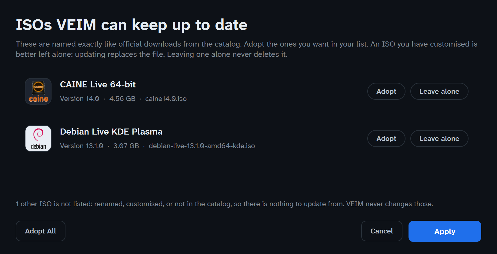

<div align="center">


# VEIM

**Ventoy Easy ISO Manager**

Download Linux, BSD and rescue-tool ISOs straight onto your [Ventoy](https://www.ventoy.net/)
USB drive, and keep every one of them up to date — all from one window.

[](https://github.com/Cir0cuit/VEIM/actions/workflows/ci.yml)


[**Download**](https://github.com/Cir0cuit/VEIM/releases/latest) · 64 distributions and tools · 216 editions


</div>

---

## What VEIM does

**Builds your drive.** Browse a catalog of 64 distributions and tools — 216
editions between them — and download any of them straight onto the drive. No
download pages, no mirror lists, no copying files around afterwards.

**Keeps it current.** One click checks every ISO on the drive against the
project that publishes it. Anything with a newer release gets an **Update**
button that downloads the new version and swaps it in.

**Looks after what's there.** ISOs you copied onto the drive yourself can be
adopted and kept up to date too. The Ventoy boot menu gets readable names —
`Linux Mint Cinnamon` instead of `linuxmint-22.3-cinnamon-64bit.iso`.

> **VEIM needs a Ventoy drive.** Ventoy is a separate tool that you install
> onto the USB drive once, [from its own site](https://www.ventoy.net/). VEIM
> manages the ISO files on that drive. It never formats, partitions or
> reflashes anything.

## Get VEIM

Pick the file for your system from the
[latest release](https://github.com/Cir0cuit/VEIM/releases/latest). Nothing
else is needed.

| | |
|---|---|
| **Windows** | `VEIM-x.y.z-windows-setup.exe` installs for your user only, so there is no administrator prompt. Prefer not to install? `VEIM-x.y.z-windows-portable.zip` runs from wherever you unpack it. |
| **macOS** | `VEIM-x.y.z-macos-arm64.dmg` for Apple Silicon, `-x86_64.dmg` for Intel. Open it and drag VEIM to Applications. |
| **Linux** | `VEIM-x.y.z-x86_64.AppImage`. Make it executable (`chmod +x`) once, then double-click. |

<details>
<summary>Windows or macOS says the app is unidentified</summary>

Releases are not code-signed — a certificate costs a few hundred dollars a
year, and this is a free tool. Every release ships `SHA256SUMS.txt` if you want
to verify what you downloaded.

- **Windows** — SmartScreen shows "Windows protected your PC". Click **More
  info**, then **Run anyway**.
- **macOS** — right-click VEIM in Applications, choose **Open**, confirm.
  Double-clicking works from then on.

</details>

VEIM checks for a new release of itself when it starts. If there is one, it
asks once — **Download**, **Skip This Version**, or **Remind Me in a Week** —
and closing the dialog simply means not now. The drive picker also has a
**Check for VEIM Updates** button.

## Getting started

1. Plug in the Ventoy drive and open VEIM. It lists the removable drives it
   can see and marks the Ventoy ones. Pick yours, or **Browse Folder…** to it.
   A freshly made drive and one you have been using for years both work.
2. **Installed** shows what is on the drive. If there are ISOs you copied there
   yourself, an **Adopt ISOs** button offers to take over the ones VEIM
   recognises, so they can be checked and updated like the rest. The others
   are left exactly as they are.
3. **Browse Catalog** — find something, choose an edition, press **Download**.
   The ISO lands on the drive, ready to boot. Queue as many as you like.
4. Come back any time and press **Check All Updates**. Anything with a newer
   release gets an **Update** button; one click replaces it.

That's the whole workflow. The rest of this page is detail.

## The catalog

<div align="center">


</div>

64 distributions and tools, 216 editions, in nine categories: Beginner
Friendly, General Purpose, Rolling Release, Enthusiast, Gaming & Performance,
Security & Privacy, Server & Enterprise, Rescue & Diagnostics, and Lightweight.

- **Search** matches names, descriptions and edition names, so typing `KDE`
  finds every KDE edition of every project, and `netinst` every network
  installer.
- **One row per project.** The editions are in a selector on the row —
  Ubuntu's twelve flavors, Debian's nine images, Proxmox's four products —
  instead of cluttering the list. Fedora has thirty-one images, so it gets four
  entries, split the way fedoraproject.org splits them: Editions, Atomic
  Desktops, Spins and Labs.
- **Download** starts right there and shows progress on the row, so you can
  keep browsing and start the next one. Several downloads run at once.
- An edition that is already on the drive shows **Installed** and offers
  **Reinstall**.

<!-- catalog:start -->

| Category | Distributions |
|---|---|
| **Beginner Friendly** | elementary OS, FydeOS, Linux Lite, Linux Mint, Pop!_OS, TUXEDO OS, Ubuntu, Zorin OS |
| **General Purpose** | Debian, Fedora, Fedora Atomic Desktops, Fedora Labs, Fedora Spins, KDE Neon, Mageia, MX Linux, openSUSE |
| **Rolling Release** | Arch Linux, Artix Linux, EndeavourOS, Manjaro, Omarchy |
| **Enthusiast** | Devuan, Gentoo, NixOS, Slackware, Void Linux |
| **Gaming & Performance** | Bazzite, CachyOS, Garuda Linux, Nobara Project, PikaOS |
| **Security & Privacy** | CAINE, HackerOS, Kali Linux, Parrot OS, Qubes OS, Tails |
| **Server & Enterprise** | AlmaLinux OS, CentOS Stream, FreeBSD, IPFire, openEuler, Oracle Linux, Proxmox, Rocky Linux, Talos Linux, XCP-ng |
| **Rescue & Diagnostics** | Clonezilla, GParted Live, Grml, hrmpf, Memtest86+, netboot.xyz, Rescuezilla, ShredOS, Super GRUB2 Disk, SystemRescue |
| **Lightweight** | Alpine Linux, antiX, Puppy Linux, Q4OS, SparkyLinux, Tiny Core Linux |

<details>
<summary>Every edition, by entry</summary>

**Beginner Friendly**

- **elementary OS** — Standard 64-bit Edition
- **FydeOS** — Intel Modern (6th - 14th Gen), AMD Graphics & APUs, Intel Slim (Celeron & Pentium)
- **Linux Lite** — 64-bit (Xfce)
- **Linux Mint** — Cinnamon, MATE, Xfce
- **Pop!_OS** — Standard (Intel / AMD), NVIDIA Edition
- **TUXEDO OS** — Standard Edition (KDE Plasma)
- **Ubuntu** — Ubuntu Desktop, Ubuntu Server, Kubuntu, Xubuntu, Lubuntu, Ubuntu MATE, Ubuntu Budgie, Ubuntu Cinnamon, Ubuntu Unity, Ubuntu Studio, Edubuntu, Ubuntu Kylin
- **Zorin OS** — Core Edition, Education Edition

**General Purpose**

- **Debian** — Netinst (Network Installer), Live GNOME, Live KDE Plasma, Live Xfce, Live Cinnamon, Live MATE, Live LXQt, Live LXDE, Live Standard (Console)
- **Fedora** — Workstation (GNOME), KDE Plasma Desktop, Server (DVD), Server (Network Install), IoT, Everything (Network Install)
- **Fedora Atomic Desktops** — Silverblue (GNOME), Kinoite (KDE Plasma), Sway Atomic, Budgie Atomic, COSMIC Atomic
- **Fedora Labs** — Astronomy, Design Suite, Games, Jam, Python Classroom, Robotics Suite, Scientific, Security Lab
- **Fedora Spins** — Xfce, Cinnamon, Budgie, COSMIC, MATE-Compiz, LXQt, LXDE, i3, Sway, Miracle, KDE Plasma Mobile, Sugar on a Stick
- **KDE Neon** — User Edition
- **Mageia** — Classic Installer (DVD), Live Edition (KDE Plasma), Live Edition (GNOME), Live Edition (Xfce)
- **MX Linux** — Xfce, Xfce AHS, KDE Plasma, Fluxbox
- **openSUSE** — Tumbleweed (Offline DVD), Tumbleweed Live (KDE Plasma), Tumbleweed Live (GNOME), Tumbleweed (Network Install), Leap (Offline DVD), Leap (Network Install)

**Rolling Release**

- **Arch Linux** — Standard ISO
- **Artix Linux** — KDE Plasma (OpenRC), Xfce Edition (OpenRC), Base Edition (OpenRC), Base Edition (Runit), Cinnamon Edition (OpenRC), MATE Edition (OpenRC)
- **EndeavourOS** — Galileo Neo
- **Manjaro** — KDE Plasma, GNOME, Xfce
- **Omarchy** — Standard

**Enthusiast**

- **Devuan** — Desktop Live, Net Install, Server
- **Gentoo** — Minimal Install CD, LiveGUI
- **NixOS** — Graphical Live Installer (GNOME), Minimal Console Edition
- **Slackware** — Install DVD (64-bit)
- **Void Linux** — Base (glibc), Xfce (glibc), Base (musl), Xfce (musl)

**Gaming & Performance**

- **Bazzite** — Desktop Edition (KDE Plasma), Desktop Edition (GNOME), Handheld Edition (Steam Deck / Ally), NVIDIA Desktop (KDE Plasma)
- **CachyOS** — Desktop Edition, Handheld Edition
- **Garuda Linux** — Dr460nized (KDE), Dr460nized Gaming Edition, GNOME Edition, KDE Lite, Xfce Edition, Cinnamon Edition, Mokka (KDE), Hyprland Edition, Sway Edition, i3 Edition
- **Nobara Project** — Official (GNOME), KDE Plasma, GNOME, Steam HTPC, Steam Handheld
- **PikaOS** — KDE Plasma, GNOME, Hyprland, KDE Plasma (NVIDIA), GNOME (NVIDIA)

**Security & Privacy**

- **CAINE** — Live 64-bit
- **HackerOS** — LTS Edition (Long Term Support), Official Edition, Cybersecurity Edition, Gaming Edition, NVIDIA Edition
- **Kali Linux** — Installer, Network Installer, Kali Purple
- **Parrot OS** — Security Edition, Home Edition
- **Qubes OS** — Installer
- **Tails** — Standard ISO Image

**Server & Enterprise**

- **AlmaLinux OS** — Minimal Install, Full DVD, Boot / Netinstall
- **CentOS Stream** — DVD, Boot
- **FreeBSD** — Installer (disc1), Installer with packages (dvd1), Network installer (bootonly)
- **IPFire** — Installer x86_64
- **openEuler** — LTS (DVD), LTS (Network Install), Innovation release (DVD), Innovation release (Network Install)
- **Oracle Linux** — Full ISO (DVD), Boot ISO
- **Proxmox** — Virtual Environment, Backup Server, Mail Gateway, Datacenter Manager
- **Rocky Linux** — DVD, Minimal, Boot
- **Talos Linux** — Bare metal (amd64)
- **XCP-ng** — Installer, Network installer

**Rescue & Diagnostics**

- **Clonezilla** — Alternative Stable (Ubuntu Base), Standard Stable (Debian Base)
- **GParted Live** — Live AMD64
- **Grml** — Full, Small
- **hrmpf** — x86_64
- **Memtest86+** — 64-bit, 64-bit (GRUB)
- **netboot.xyz** — Standard ISO
- **Rescuezilla** — Standard 64-bit
- **ShredOS** — Standard x86-64
- **Super GRUB2 Disk** — Hybrid (BIOS and UEFI), 64-bit UEFI, Legacy BIOS, 32-bit UEFI
- **SystemRescue** — Live AMD64

**Lightweight**

- **Alpine Linux** — Standard x86_64, Extended x86_64, Virtual x86_64, Xen x86_64
- **antiX** — Full, Core
- **Puppy Linux** — BookwormPup64, FossaPup64, TrixiePup64
- **Q4OS** — KDE Plasma Live, Trinity Live, Install CD
- **SparkyLinux** — Xfce Edition, KDE Plasma Edition, LXQt Edition, MATE Edition, MinimalGUI (Openbox), MinimalCLI (Console), Rolling: Xfce, Rolling: KDE Plasma, Rolling: LXQt, Rolling: MATE, Rolling: MinimalGUI, Rolling: MinimalCLI, Rolling: GameOver, Rolling: Multimedia, Rolling: Rescue
- **Tiny Core Linux** — CorePlus (x86), TinyCore (x86), CorePure64 (x86_64), TinyCorePure64 (x86_64), Core (x86)

</details>

<!-- catalog:end -->

Two things are left out on purpose. Kali's Live and Everything images are
torrent-only, so there is nothing to download from. And images whose filename
never changes between releases — Bazzite's `-stable`, `netboot.xyz.iso`,
anything `-latest` — download and update fine through the catalog, but a copy
already on a drive can't be told apart from an older one, so those are never
offered for adoption (see below).

Missing a project? Adding one is a small, well-trodden job —
[CONTRIBUTING.md](CONTRIBUTING.md) walks through it.

## Keeping the drive up to date

**Check All Updates** asks every project on the drive for its current release,
all at once. Rows read **Checking…** while they wait, then each one shows:

| | |
|---|---|
| **Up to date** | The version on the drive is what the project publishes now. |
| **Update to 44** | There is a newer release. The row's button names it, and pressing it downloads that release. |
| **Newer than 43** | The drive holds a *later* release than VEIM can find — a beta you fetched yourself, say. Nothing is offered, because it would be a downgrade. |
| **No current release** | The project's download page couldn't be read just now: a mirror is down, or the page has changed. The ISO is fine to boot. VEIM says this instead of guessing. |

The header sums it up — *2 updates available*, or *all up to date* — and any
single row can be checked on its own.

Above the list, the drive map shows the drive to scale: a block for each ISO,
as wide as its file and coloured like its logo, then everything else on the
drive, the space downloads in progress still need (hatched), and what is free.
Point at a block to see which ISO it is.

The update button downloads the new release and replaces the old one. The progress
shows on the row itself, with a **Cancel** button. The old ISO stays on the
drive and bootable until the new file has fully arrived and been verified;
only then is it swapped in and the old one removed.

## ISOs you already have

Already have ISOs on the drive? VEIM doesn't take them over on sight. When it
finds files it recognises — named exactly the way the project itself names
that download — the library shows an **Adopt ISOs** button, and you decide.

<div align="center">



</div>

- **Adopt** — it joins the list, checked and updated like anything VEIM
  downloaded. A file sitting in the drive root is moved into `Managed_ISOs/`.
- **Leave alone** — VEIM stops asking about it. The button becomes
  **Excluded ISOs** so you can change your mind later.
- Decide later — it comes up again next time.

A renamed, customised or unrecognised ISO is never listed, tracked or touched.
It boots as usual; the library just notes how many such files it is leaving
alone. If any of those sit in the drive root, where Ventoy no longer looks
once VEIM has set it up, you are offered a plain move into `Managed_ISOs/`
right after adopting — so they come back into the boot menu, still unmanaged. That's deliberate: a customised Clonezilla mistaken for the official one
would be "updated" — overwritten — at the next check.

**Remove** on any row asks which you mean: **Delete File**, or **Keep File,
Stop Managing**. A kept file stays on the drive and keeps booting; VEIM simply
stops checking it. That's also the way out for an ISO adopted by mistake.

## Downloads you can rely on

- **Resumable.** Downloads stream to a `.part` file. If the connection drops,
  VEIM waits and reconnects — 2, 5, 10, then 20 seconds, with the countdown
  shown on the row — and resumes from where it stopped. A link that keeps
  dropping but keeps delivering is never given up on; only four attempts in a
  row that get nowhere end in a failure. If you close VEIM, the transfer picks
  up where it stopped next time you press the button. Only cancelling on
  purpose throws the partial file away.
- **Verified.** Where a project publishes a SHA-256, the finished file is
  checked before it becomes a `.iso`. A mismatch is deleted, and the row tells
  you.
- **Space-checked.** Free space is confirmed before a single byte is written,
  counting what the downloads already running still have to write. Six
  transfers started at once cannot overfill the drive between them. The drive
  map and the sidebar gauge show that space as spoken for, and re-read the drive
  every couple of seconds while anything is downloading. When an update would
  fit only in the old ISO's place, VEIM asks before deleting the old one first
  — and says plainly that a download that then fails leaves neither on the
  drive.
- **Always the current release.** VEIM never downloads from a URL it
  remembered. Every transfer starts by reading the project's own release page
  at that moment and taking the newest release by version number — never a
  `-latest` alias, never a hardcoded folder, never an older release that
  happened to be reachable when the current one wasn't. That is what stops a
  "latest" ISO quietly being two years old.
- **Bootable as delivered.** Memtest86+ ships its image inside a `.zip`; VEIM
  unpacks the ISO and drops the archive.

## On the drive

| | |
|---|---|
| `Managed_ISOs/` | The ISOs, plus `veim_inventory.json`: what each file is, which version, and which files you asked to be left alone. Delete it and you lose only the list — the ISOs stay, and are offered for adoption again. |
| `ventoy/ventoy.json` | Written by VEIM. Points Ventoy at `Managed_ISOs/` and gives every managed ISO a menu name. Aliases you wrote for files elsewhere on the drive are kept. Because the menu is limited to `Managed_ISOs/`, an ISO left in the drive root drops out of it; the library says so and offers to move it in, without managing it. |

VEIM writes nowhere else on the drive. On your computer it keeps a log, the
rendered logos and the note of which VEIM release you skipped, in
`%LOCALAPPDATA%\VEIM`, `~/.local/share/VEIM` or
`~/Library/Application Support/VEIM`.

## Troubleshooting

**Downloads are slow.** Two things set the pace: your internet connection and
how fast the USB stick can write. VEIM streams each ISO straight onto the
drive, so it can never go faster than the stick accepts data — and cheap or
older sticks often manage 10–30 MB/s on sustained writes, whatever the box
says. Several downloads at once share both the connection and the stick, so
each one shows a lower speed than it would alone; the total is the same. A
slow mirror is the third possibility: VEIM downloads from the project's own
official mirror, and some are simply busier than others.

**"Connection lost, retrying in 10 s."** The link dropped. VEIM waits and
reconnects on its own — 2, 5, 10, then 20 seconds — and resumes from where it
stopped. A download only fails after four attempts in a row that get
nowhere. If it does, press **Download** or **Update** again: the partial file
is still there and the transfer resumes from it.

**"No current release."** VEIM could not read that project's download page
just now — a mirror is down, or the page has changed. The ISO on your drive is
fine to boot. Try again later; if it stays that way for days, the recipe
probably needs updating for a redesigned page — please
[open an issue](https://github.com/Cir0cuit/VEIM/issues).

**"Not enough space on drive."** The figure counts what the downloads
already running still have to write, so a drive that looks half empty can be
fully spoken for. Wait for them to finish, or cancel one. For an update that
would fit only in the old ISO's place, VEIM offers to delete the old one
first — read that dialog before accepting it.

**A download failed its checksum.** The file was deleted on purpose: what
arrived did not match what the project published, and a corrupt ISO fails at
boot in far more confusing ways. Download it again. If it fails twice, the
mirror is serving a bad file — that happens, and usually fixes itself.

**The drive is not in the list.** Only mounted drives are offered. Plug it
in, wait for the system to mount it, press **Refresh**. If it still isn't
there, **Browse Folder…** straight to it. A "small partition" warning means
you picked Ventoy's EFI partition; choose the large one.

**An ISO I copied on isn't offered for adoption.** VEIM adopts only a file
named exactly the way the project publishes it — that is how it knows which
version you have. A renamed or customised ISO, or one from a project not in
the catalog, is left alone on purpose. Images whose filename never changes
(`netboot.xyz.iso`, Bazzite's `-stable`) can't be told apart from older
copies, so they are never adopted either; downloading them through the
catalog instead gives VEIM a version to track.

**An ISO in the drive root disappeared from the boot menu.** Once VEIM has
written `ventoy/ventoy.json`, Ventoy lists `Managed_ISOs/` only. The library
notices ISOs left in the root and offers to move them in; that's all it
takes. They are not managed afterwards, just visible again.

**I edited `ventoy.json` by hand and my aliases vanished.** Aliases for files
in `Managed_ISOs/` are VEIM's to write; it regenerates them from the library.
Aliases for files anywhere else on the drive are kept exactly as you wrote
them.

**Something else went wrong.** The log is `veim.log` in
`%LOCALAPPDATA%\VEIM`, `~/.local/share/VEIM` or
`~/Library/Application Support/VEIM` (the directory you started it from, when
running from source). It says what VEIM asked for, what it got back, and why
it stopped. Attach it to an [issue](https://github.com/Cir0cuit/VEIM/issues).

## Themes

Dark Modern, Amoled Black, Gruvbox Dark, Cyberpunk, Nord, Dracula, Solarized
Light and Clean Light — or **System**, which follows your desktop.

<div align="center">

  

<em>Gruvbox Dark · Amoled Black · Solarized Light</em>

</div>

## Run from source

```bash
git clone https://github.com/Cir0cuit/VEIM
cd VEIM
pip install -r requirements.txt
python main.py
```

Python 3.10 or newer. [CONTRIBUTING.md](CONTRIBUTING.md) covers the test
suite, the code layout, adding a distribution or a theme, and how the
installers are built.

## License

MIT — see [LICENSE](LICENSE).

Distribution names and logos are trademarks of their respective projects and
are used only to identify them. The rendered logos are in
[`src/assets/icons/`](src/assets/icons/); if you fork and redistribute VEIM,
check each project's trademark policy.
